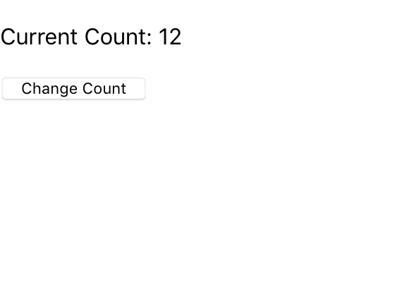

# React Hooks Example

This project demonstrates the use of React hooks as a way to manage state in your single page application.

React hooks requires the newest version (version 16.8) of React to use but is backwards compatible with older versions of React so you and upgrade your projects without refactoring your code.

## Create React App

The easiest way to get started with React is to use create-react-app provided by the npx package runner. Start by cloning this repository, `cd` into this project directory and run this command.

```
$ npx create-react-app counter-example
```

This will scaffold out a basic React application inside this project directory.

## Refactor App.js to use Functions

Prior to the new version of React, create-react-app created an App component using a class. Now however you're started with a functional component.

Lets refactor it so we can see what's happening easier:

```javascript
import React from 'react';

function App(){

  return (
    <div>
      <p>Hello World!</p>
    </div>
  )
}

export default App;
```

Run `npm install` and `npm start` to see the output `Hello World!` in the browser.

This is what a regular functional component looks like in React. Let's now add the new `useState` hook.

Change the import to the following:

```javascript
import React, { useState } from 'react';
```

The new `useState` hook will allow us to create state in our functional component. No longer is state limited to just classes in React.

When you call `useState`, it will return back to you two things: the current value of the state, and a function that allows you to change it.

Let's go over a simple example listed in the official React documentation.

First we create some state by adding this line before the return statement.

```javascript
const [count, setCount] = useState(0);
```

This silly syntax is [Javascript array destructuring](https://developer.mozilla.org/en-US/docs/Web/JavaScript/Reference/Operators/Destructuring_assignment) at work. `useState()` returns an array where the first element contains the value of the state you're tracking and the second is the function that sets the value.

In this example our state is named `count` and the setter function is named `setCount`. Instead of calling `setState`  and passing in an object, we will simply call `setCount` and pass in the value we want to set it as.

Also this line initializes `count` to `0`, but we could choose to initialize it to many other things including some other hooks.

Finally in our return statement we want to render and change the results.

Replace the contents in the return statement with this.

```html
<div>
  <p>Current Count: {count}</p>
  <button onClick={()=> setCount(count + 1)}>Change Count</button>
</div>
```

If you run `npm start` you should see the following show up in the browser:



## Lifecycle Methods
Included in each class component are a myriad of lifecycle methods that you can define that allow you to fire off tasks and respond to external events. In order to use certain event listeners or make API requests many of these methods become necessary. Functional components replace all of them with a single hook, `useEffect()`. This one function takes all of the code duplication out of the lifecycle methods -- very much on purpose.

Let's take a look at this function in depth.

## `useEffect()`
First `import` it.

```javascript
import { useEffect } from 'react';
```

Here is a simple example for how it's used in your functional component.

```javascript
useEffect(function(){
  // This will log 'Foo!' to the console
  // every time the component is re-rendered
  console.log("Foo!")
})
```

This function will be called every single time react renders the component. If instead you want to increase performance and run this function only when certain things change then you can pass in an array of these states.

```javascript
useEffect(function(){
  // This will log 'Foo!' to the console
  // only when props.stateOne or props.stateTwo change
  console.log("Foo!")
}, [props.stateOne, props.stateTwo])
```

Be sure that the all necessary state is passed in or you cannot be guanteed that it will be accurate.

## Cleanup After Unmounting

```javascript
useEffect(function(){
  const handleResize = () => {console.log(window.innerWidth)}
  window.addEventListener('resize', handleResize});

  return function(){
    window.removeEventListener('resize', handleResize);
  }
})
```

In order to remove listeners and do any other cleanup `useEffect` allows you to return a callback that will be called when the component unmounts. Nothing else can be returned from `useEffect`.

## Context
Context borrows ideas from Redux and bakes them into react. Many of the same terminology applies both in Redux and here.

In order for state to be shared across multiple components we used to have to pass props down the hierarchical tree to the component that needed it. Context solves that issue by allowing us access to a store of information that contains the state we need. Context does increase the complexity of your code so it's best to use it sparingly. If you only have a single component nested deeply, you could even just pass your component down the hierarchy tree instead the individual props it requires. In spite of this, context can be very useful if you find that you need to pass a lot props around through components that don'e need them.

## Create a store
Because your application may have many contexts, it's useful to be able to keep track of them in a single folder.
Let's make a folder to keep our stores in and name it `./src/store/`.

Inside the `store` folder we're going to make a simple counter.

```javascript
import React, { Component } from 'react';

// First we need a new Context
export const CounterContext = React.createContext();

// Next we need a provider
export class CounterProvider extends Component {
  state = {
    counter: 0
  }
  render() {
    return (
      <CounterContext.Provider value={{
        state: this.state,
        addCount: () => this.setState({
          counter: this.state.counter + 1
        }),
        subCount: () => this.setState({
          counter: this.state.counter - 1
        })
      }}>
        {this.props.children}
      </CounterContext.Provider>
    )
  }
}
```

In this example we have setters inside of the value attribute. This works but it may cause additional renders if they change at all. You could also put these functions inside of your state object to prevent components from re-rendering too often.

## Provide Access to the Store

Now that we have a store, we need to provide access to it by wrapping the component that will use it in a Provider.

Here is our basic app with our counter component wrapped in our Provider.

```javascript
import React from 'react';
import {CounterProvider} from './store/simpleContext';
import Counter from './components/Counter';

function App() {
  return (
    <div className="App">
      <CounterProvider>
        <Counter/>
      </CounterProvider>
    </div>
  );
}

export default App;
```

## Consume State with a Consumer

Now that we have provided access to the store from our component, we need to consume our data. We can only access state from our store inside of the consumer.

Here is the counter component we need that can access our store.

```javascript
import React from 'react';
import {CounterContext} from '../store/simpleContext';

function Counter(){
  return(
    <div>
      <CounterContext.Consumer>
        {(context)=>(
          <div>
            <p>Count: {context.state.counter}</p>
            <button onClick={context.addCount}>+</button>
            <button onClick={context.subCount}>-</button>
          </div>
        )
        }
      </CounterContext.Consumer>
    </div>
  )
}

export default Counter;
```

You should have a working counter at this point. If you're having trouble following this tutorial, the answers reside in the `context` branch and `state-effect` branch to help you out.
